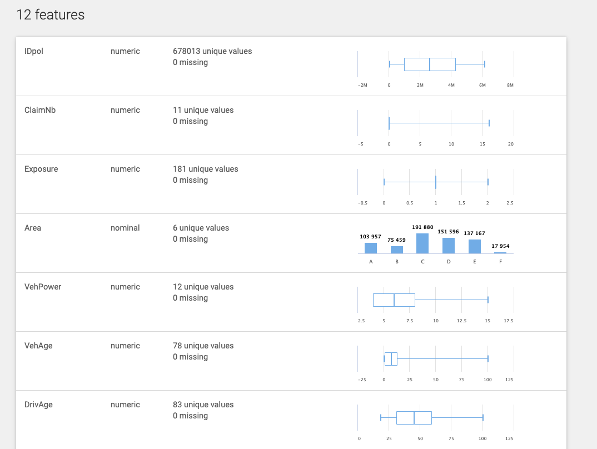
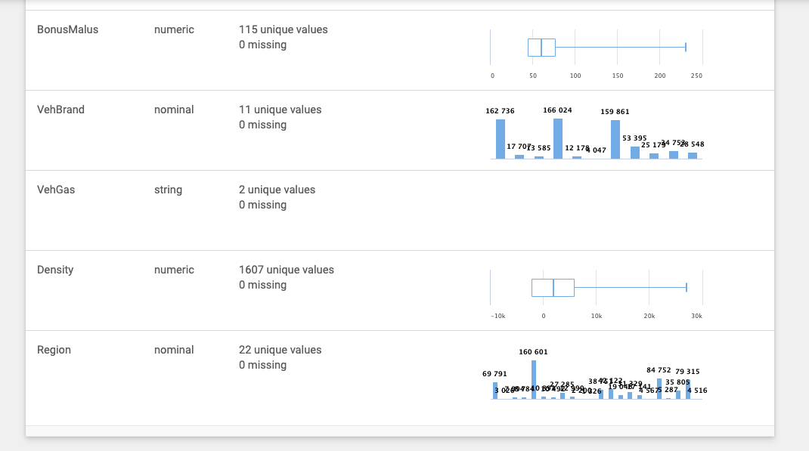
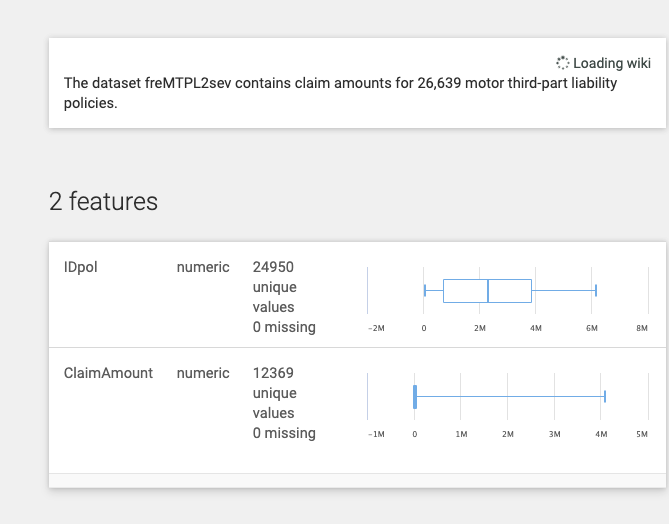

# French Motor Claims
Data source:
- [data without claim amount from openml](https://www.openml.org/d/41214)
- [data without claim amount from kaggle](https://www.kaggle.com/btw78jt/french-motor-claims-model-comparisons/#data)
- [data only claim amount and id openml](https://www.openml.org/d/41215)


# Code
```python
p = 'https://github.com/bhishanpdl/Datasets/blob/master/'
p += 'Projects/French_Motor_Claims/raw/'
ifile = p + 'freMTPL2freq.csv?raw=true'

df = pd.read_csv(ifile)
print(df.shape)

df.head(2).append(df.tail(2)).append(df.dtypes,ignore_index=True)
```

# Data




# Context
In the dataset freMTPL2freq risk features and claim numbers were collected for 677,991 motor third-part liability policies (observed on a year).

# Content
freMTPL2freq contains 11 columns (+IDpol): • IDpol The policy ID (used to link with the claims dataset). • ClaimNb Number of claims during the exposure period. • Exposure The exposure period. • Area The area code. • VehPower The power of the car (ordered categorical). • VehAge The vehicle age, in years. • DrivAge The driver age, in years (in France, people can drive a car at 18). • BonusMalus Bonus/malus, between 50 and 350: 100 means malus in France. • VehBrand The car brand (unknown categories). • VehGas The car gas, Diesel or regular. • Density The density of inhabitants (number of inhabitants per km2) in the city the driver of the car lives in. • Region The policy regions in France (based on a standard French classification)

# Acknowledgements
Source:  
R-Package CASDatasets, Version 1.0-6 (2016) by Christophe Dutang [aut, cre], Arthur Charpentier [ctb]


