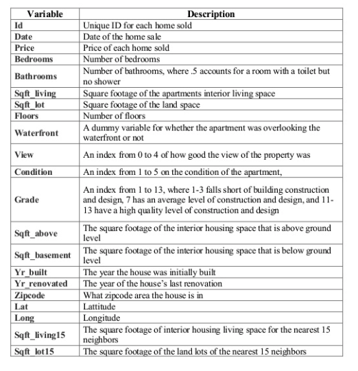

# King County data set
Ref: https://www.kaggle.com/harlfoxem/housesalesprediction

# Code
```python
p = 'https://github.com/bhishanpdl/Datasets/blob/master/'
p += 'Projects/King_County_Seattle_House_Price_Kaggle/processed/'
ifile = p + 'data_cleaned_encoded.csv?raw=true'

df = pd.read_csv(ifile)
print(df.shape)

df.head(2).append(df.tail(2)).append(df.dtypes,ignore_index=True)
```

# Data description

