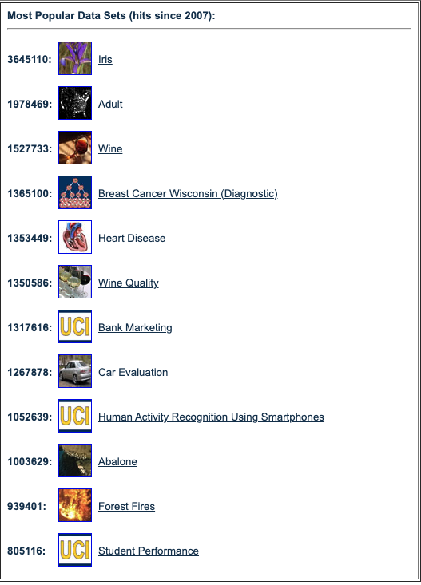

Table of Contents
=================
   * [Links to get datasets](#links-to-get-datasets)
   * [Seaborn datasets](#seaborn-datasets)
   * [sklearn datasets](#sklearn-datasets)
   * [Statsmodels datasets](#statsmodels-datasets)

# Links to get datasets
- [Analytics Vidhya](https://datahack.analyticsvidhya.com/contest/all/)
- [Awesome Public Datasets](https://github.com/awesomedata/awesome-public-datasets)
- [Buzzfeed](https://www.buzzfeed.com/)
- [Data gov](https://www.data.gov/)
- [Data World](https://data.world/)
- [e for Excel](http://eforexcel.com/wp/downloads-18-sample-csv-files-data-sets-for-testing-sales/) Real finance data
- [Fivethirtyeight](https://fivethirtyeight.com/)
- [Google Dataset Search](https://datasetsearch.research.google.com/)
- [Google Bigquery](https://cloud.google.com/bigquery/public-data/)
- [ImageNet](http://image-net.org/)
- [Kaggle](https://www.kaggle.com/datasets)
- [KDNuggets](http://www.kdnuggets.com/datasets/index.html)
- [MNIST](http://yann.lecun.com/exdb/mnist/)
- [MovieLens](http://grouplens.org/)
- [Movie Review Data](http://www.cs.cornell.edu/People/pabo/movie-review-data/)
- [OpenML](https://www.openml.org/home)
- [Quandl](https://www.quandl.com/)
- [Reddit Datasets Subreddit](https://www.reddit.com/r/datasets/)
- [Socrata](https://opendata.socrata.com/)
- [Spam – Non Spam](http://www.esp.uem.es/jmgomez/smsspamcorpus/)
- [Twitter Sentiment Analysis](http://thinknook.com/twitter-sentiment-analysis-training-corpus-dataset-2012-09-22/)
- [UCI Machine Learning Repository](https://archive.ics.uci.edu/ml/index.php)
- [World Bank](http://data.worldbank.org/)
- [Youtube](https://research.google.com/youtube8m/)
- [data is plural: intersting data](https://github.com/data-is-plural/newsletter-archive)
- [Lionbridge: The Ultimate Dataset Library for Machine Learning](https://lionbridge.ai/datasets/ultimate-dataset-aggregator-for-machine-learning/)
- [datasciencedojo: 30 Data Sets to Uplift your Skills in Data Science](https://blog.datasciencedojo.com/30-datasets-to-uplift-your-skills-in-data-science/)


# Create Realistic Data
- [Mockaroo realistic data generator](https://mockaroo.com/)

# Read and download datasets
- [neptune.ai: How to Deal with Files in Google Colab: Everything You Need to Know](https://neptune.ai/blog/google-colab-dealing-with-files)

# Read data from url
```python
def get_url_data(url,n=0):
    from urllib.request import Request, urlopen
    from bs4 import BeautifulSoup

    req = Request(url, headers={'User-Agent': 'Mozilla/5.0'})
    page = urlopen(req).read()

    soup = BeautifulSoup(page, 'lxml')
    table = soup.find_all('table')
    df_ = pd.read_html(str(table))[n]
    return df_

url = 'https://gasprices.aaa.com/state-gas-price-averages/'
gas = get_url_data(url)
gas.head(2)
```

Method 02: **I Got SSL Error**
```python
import pandas as pd
import requests

url = "https://worldpopulationreview.com/countries/countries-by-gdp/#worldCountries"

r = requests.get(url)
df_list = pd.read_html(r.text) # this parses all the tables in webpages to a list
df = df_list[0]
df.head()
```


# Seaborn datasets
```python
import seaborn as sns
iris = sns.load_dataset('iris')

print(sns.get_dataset_names())
'anscombe', 'attention', 'brain_networks', 'car_crashes', 'diamonds', 'dots', 'exercise', 'flights', 'fmri', 
'gammas', 'iris', 'mpg', 'planets', 'tips', 'titanic'
```

# sklearn datasets
```python
from sklearn import datasets

fnames = [ i for i in dir(datasets) if 'load_' in i]
print(fnames)
# 'load_boston', 'load_breast_cancer','load_diabetes', 'load_digits', 'load_files'
# 'load_iris', 'load_linnerud','load_mlcomp','load_sample_image','load_sample_images',
# 'load_svmlight_file', 'load_svmlight_files', 'load_wine'

iris = datasets.load_iris()
iris_df = pd.DataFrame(iris.data, columns=iris.feature_names)
print(datasets.load_iris().DESCR)

X,y = datasets.load_iris(return_X_y=True) # numpy arrays
dic_data = datasets.load_iris(as_frame=True)
print(dic_data.keys())
df = dic_data['frame']
df_X = dic_data['data']
ser_y = dic_data['target']
dic_data['target_names'] # numpy array

**
from sklearn import datasets

fnames_and_others = [ i for i in dir(datasets) if 'load_' in i]
fnames = ['load_boston', 'load_breast_cancer', 'load_diabetes',
          'load_digits', 'load_iris', 'load_wine']
print(fnames)

fname = 'load_boston'
loader = getattr(datasets,fname)()
df = pd.DataFrame(loader['data'],columns= loader['feature_names'])
df['target'] = loader['target']
df.head(2)

for fname in fnames:
    print()
    print(fname)
    loader = getattr(datasets,fname)()
    df = pd.DataFrame(loader['data'],columns= loader['feature_names'])
    df['target'] = loader['target']
    display(df.head(2))
```

# Statsmodels datasets
```python
import statsmodels.api as sm

# built-in datasets
excludes = ['PytestTester', 'test', 'utils','webuse',
            'get_data_home', 'get_rdataset','check_internet','clear_data_home',]
fnames = [i for i in dir(sm.datasets) if i[0]!='_' if i not in excludes ]
print(fnames)
# ['anes96', 'cancer', 'ccard', 'china_smoking', 'co2', 'committee',
# 'copper', 'cpunish', 'elnino', 'engel', 'fair', 'fertility', 'grunfeld',
# 'heart', 'interest_inflation', 'longley', 'macrodata', 'modechoice', 'nile',
# 'randhie', 'scotland', 'spector', 'stackloss', 'star98', 'statecrime', 'strikes', 'sunspots']

for fname in fnames:
    print()
    print(fname)
    df = getattr(sm.datasets,fname).load_pandas().data
    display(df.head(2))

**
import statsmodels.api as sm

## built-ins
co2 = sm.datasets.co2  # time series data for co2
print(co2.DESCRLONG)
df = sm.datasets.co2.load_pandas().data

**
co2 = sm.datasets.co2.load_pandas() # statsmodels data object
co2.names # ('date', 'co2')
co2.data # pandas dataframe
co2.raw_data # numpy rec array without names
co2.values() # numpy rec array with names
co2.data.values # numpy array from pandas dataframe

**
## dataframe from numpy records object
## NOTE: Compare the dataframe with the one directly
##       downloaded from below link:
## https://raw.githubusercontent.com/statsmodels/statsmodels/master/statsmodels/datasets/co2/co2.csv
##
df = pd.DataFrame.from_records(sm.datasets.co2.load().data)
df['date'] = df.date.apply(lambda x: x.decode('utf-8'))
df['date'] = pd.to_datetime(df.date, format='%Y%m%d')
df['co2'] = pd.to_numeric(df.co2, errors='coerce')
df = df.set_index('date')
df.head()
==>  aliter:
df = pd.read_csv('co2.csv',index_col=0)
df.index = pd.to_datetime(df.index,format='%Y%m%d')
df.co2.sum(), df2.co2.bfill().sum()

## using rdataset
df_iris = sm.datasets.get_rdataset('iris').data
dataset_iris = sm.datasets.get_rdataset(dataname='iris', package='datasets')
print(dataset_iris.title) # "Edgar Anderson's Iris Data"
print(dataset_iris.__doc__)
```

Sometimes we need to get R dataset from specific library. Then google that dataset and find the host site. 
Then use wget to download the data.
Example auto insurance premium modelling tweedie
- https://towardsdatascience.com/insurance-risk-pricing-tweedie-approach-1d71207268fc
- https://gist.github.com/ajaytiwari-isb/dd78b382c44d69332574c381e016af2a#file-tweedie-regression-ipynb

```python

!wget http://www.businessandeconomics.mq.edu.au/__data/assets/file/0011/232310/car.csv
df = pd.read_csv("car.csv")
```

Statsmodels provides access to 1173 datasets from the [Rdatasets project](https://github.com/vincentarelbundock/Rdatasets).
Also, it has following built in datasets:
- anes96:  [American National Election Survey 1996](http://www.statsmodels.org/dev/datasets/generated/anes96.html)
- cancer: [Breast Cancer Data](http://www.statsmodels.org/dev/datasets/generated/cancer.html)
- ccard: [Bill Greene’s credit scoring data.](http://www.statsmodels.org/dev/datasets/generated/ccard.html)
- china_smoking: [Smoking and lung cancer in eight cities in China.](http://www.statsmodels.org/dev/datasets/generated/china_smoking.html)
- co2: [Mauna Loa Weekly Atmospheric CO2 Data](http://www.statsmodels.org/dev/datasets/generated/co2.html)
- committee: [First 100 days of the US House of Representatives 1995](http://www.statsmodels.org/dev/datasets/generated/committee.html)
- copper: [World Copper Market 1951-1975 Dataset](http://www.statsmodels.org/dev/datasets/generated/copper.html)	
- cpunish: [US Capital Punishment dataset](http://www.statsmodels.org/dev/datasets/generated/cpunish.html)
- elnino: [El Nino - Sea Surface Temperatures	](http://www.statsmodels.org/dev/datasets/generated/elnino.html)
- engel: [Engel (1857) food expenditure data](http://www.statsmodels.org/dev/datasets/generated/engel.html)
- fair: [Affairs dataset](http://www.statsmodels.org/dev/datasets/generated/fair.html)
- fertility: [World Bank Fertility Data](http://www.statsmodels.org/dev/datasets/generated/fertility.html)
- grunfeld: [Grunfeld (1950) Investment Data](http://www.statsmodels.org/dev/datasets/generated/grunfeld.html)
- heart: [Transplant Survival Data](http://www.statsmodels.org/dev/datasets/generated/heart.html)
- longley: [Longley dataset](http://www.statsmodels.org/dev/datasets/generated/longley.html)
- macrodata: [United States Macroeconomic data](http://www.statsmodels.org/dev/datasets/generated/macrodata.html)
- modechoice: [Travel Mode Choice](http://www.statsmodels.org/dev/datasets/generated/modechoice.html)
- nile: [Nile River flows at Ashwan 1871-1970](http://www.statsmodels.org/dev/datasets/generated/nile.html)
- randhie: [RAND Health Insurance Experiment Data](http://www.statsmodels.org/dev/datasets/generated/randhie.html)
- scotland: [Taxation Powers Vote for the Scottish Parliamant 1997](http://www.statsmodels.org/dev/datasets/generated/scotland.html)
- spector: [Spector and Mazzeo (1980) - Program Effectiveness Data](http://www.statsmodels.org/dev/datasets/generated/spector.html)
- stackloss: [Stack loss data](http://www.statsmodels.org/dev/datasets/generated/stackloss.html)
- star98: [Star98 Educational Dataset](http://www.statsmodels.org/dev/datasets/generated/star98.html)
- statecrime: [Statewide Crime Data 2009](http://www.statsmodels.org/dev/datasets/generated/statecrime.html)
- strikes: [U.S. Strike Duration Data](http://www.statsmodels.org/dev/datasets/generated/strikes.html)
- sunspots: [Yearly sunspots data 1700-2008](http://www.statsmodels.org/dev/datasets/generated/sunspots.html)

# Reading datasets
```python
ifile = "https://github.com/bhishanpdl/Datasets/blob/master/Kaggle/IMDB/imdb.zip?raw=true"
df = pd.read_csv(ifile,compression='zip')
print(f"df {df.shape}")
display(df.head(2).append(df.tail(2)))
```


# [UCI Most popular datasets](http://archive.ics.uci.edu/ml/index.php)

